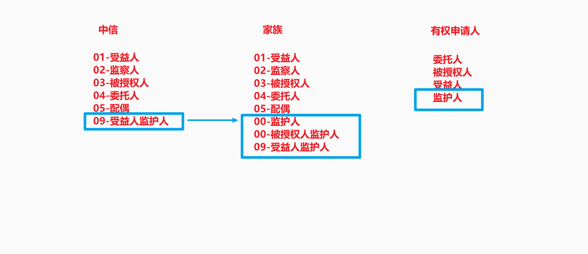
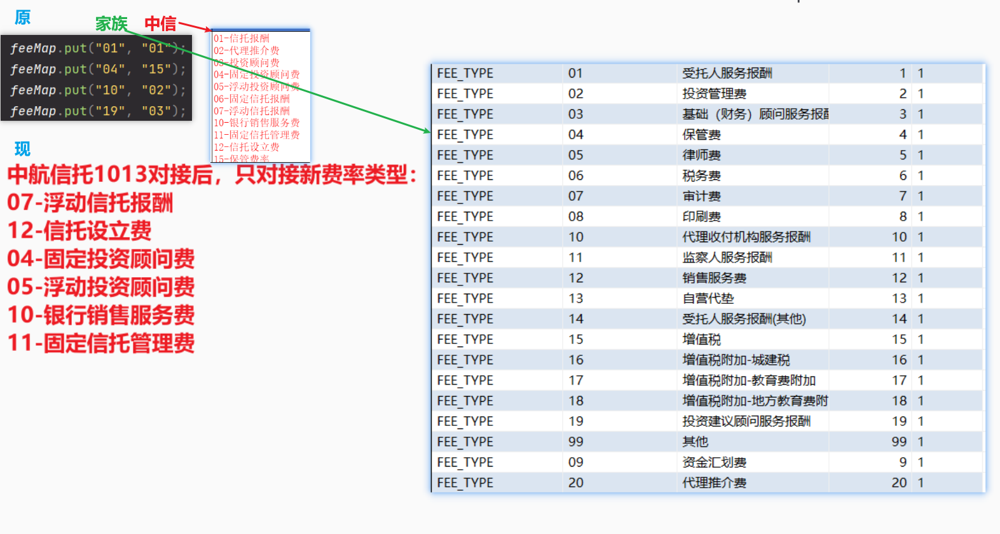

# 0922

## 1.受益分配申请

如果受益人是未成年，签署人列表和受益分配申请函中显示为其监护人三要素，签名依然是受益人（签名）。

## 2.申请反馈

### 签署人维护

家族里被授权人监护人和受益人监护人如何对应中信

监护人，被授权人和被授权人监护人，关系人里的其他暂时不处理，签署人列表直接不展示这四种，受益人监护人对应有权申请人的监护人。

# 1117

## 1.中收参数费率区块链文件推送

生效费率？
费用类型除了 04 和 10 均不同步？
四个字段取值？

无投顾的时候判断有没有投资顾问费，有就去掉。

测试 FTB 028 的项目
CMB_PRJ_ID：BP-2023080300030602
PRJ_NO：202013935
项目名：恒泰2023157号

## 2.FTB028 推送项目费率改造

## 3.信息变更完成通知

## 4.利益支付变更

# 1124

## 1.利益支付申请改造

1.财富顾问提交后——反馈状态——利益支付待生成（原客户已确认）

2.点击反馈->录入反馈原因——反馈状态—— 已回退，待重新发送申请

3.点击修改->保存之后——反馈状态——（申请要素已变更，待回退）此时只能反馈

4.点击生成利益支付——反馈状态——利益支付已生成

5.综管审批通过——反馈状态——利益支付待执行

6.手动点击确认——反馈状态——利益支付已执行

综管审批通过后通知专区待执行，同时推送专区门户消息节点
利益支付手动点击确认后通知专区已执行
利益支付打回，同时推送专区门户消息节点

# 1208

## 1.信托终止申请

## 2.信托终止申请反馈

## 3.信托终止已签署文件接收

## 4.生成项目清算

# 0202

## 1.意向合同返回信托要素表

### 1.调整调用生成意向合同接口参数

原逻辑为查询到合同模板后遍历模板，在循环中调用生成合同。这次配合文档中心调整为在循环中组装好参数，只调用一次批量生成合同。

批量生成合同参数新增field4字段，固定传1。

批量生成合同参数新增field5字段，传项目全称（【安享型】外贸信托-恒XXXXXX号信托）。

## 2.生成交易

1. 点击生成交易后，联查 INV_ADVICE 和 PROP_PRD_INF
   INV_ADVICE. PRODUCT_CODE = PROP_PRD_INF. PRD_NO		

2. 查询内部产品表 INV_PRD_INF

   如果是中信银行渠道且为认购：SELECT * FROM INV_PRD_INF WHERE INV_PRD_NO_OUT = INV_ADVICE.PRODUCT_CODE

   其他：SELECT * FROM INV_PRD_INF WHERE INV_PRD_NO_OUT = PROP_PRD_INF.PRD_NO

3. 投资事项申请明细表赋值：

   认购风险等级RISK_GRADE、标的类型TARGET_TYPE、产品编号INV_PRD_NO、产品名称INV_PRD_NAME、外部产品编号INV_PRD_NO_OUT、产品代码PRODUCT_CODE

# 0220

